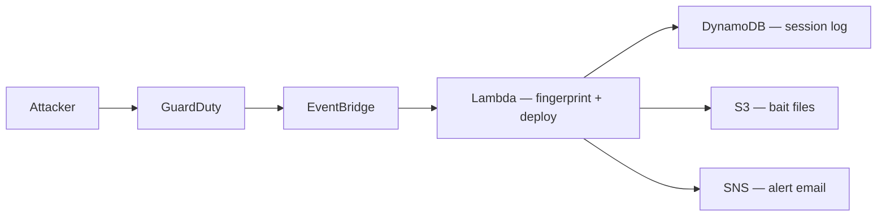

# Terraform Honeypot — Automated Deception Infrastructure on AWS

> Defensive security project that auto-deploys a fake AWS environment the moment an attacker scans your infrastructure. Built with Terraform IaC for reproducible, one-command deployment.

## How It Works

1. **Attacker scans** your AWS infrastructure
2. **GuardDuty** flags the behaviour (T1595 — Active Scanning)
3. **EventBridge** routes the finding in real time
4. **Lambda** fingerprints the attacker (IP, method, timing)
5. **Decoy environment** is deployed with bait files on S3
6. **DynamoDB** logs every session detail
7. **SNS** sends an immediate alert email

## Architecture



## MITRE ATT&CK Mapping

| Technique | ID | Detection Point |
|---|---|---|
| Active Scanning | T1595 | GuardDuty → EventBridge trigger |
| Phishing for Information | T1598 | S3 bait file access logging |

## Deploy

```bash
terraform init
terraform apply
```

Tears down cleanly:
```bash
terraform destroy
```

## Stack

- **IaC:** Terraform (HCL)
- **Runtime:** Python 3.x (Lambda)
- **Services:** GuardDuty · EventBridge · Lambda · S3 · DynamoDB · SNS
- **Cost:** ~$0/month at low traffic (Lambda free tier + GuardDuty trial)

## Security & Ethics

This project is for defensive research and authorised environments only. Deploy in infrastructure you own or have explicit permission to monitor.

## Author

Aaditya Bhutra · [LinkedIn](https://linkedin.com/in/aaditya-bhutra) · [GitHub](https://github.com/aadityabhutra)
